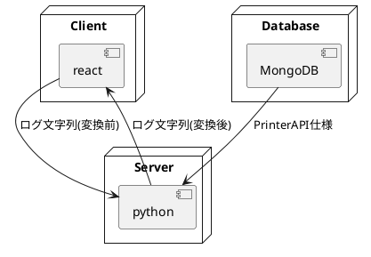
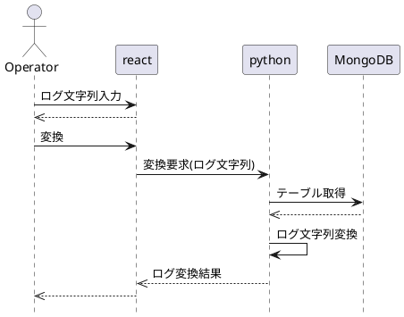

# PPSPログ解析ツール(Web版)

## 機能要件

* 対象ログの文字列をPrinterAPI仕様書に記載された定数制限へ変換する

## システム要件

* Python3.8
* npm

### 環境構築

#### Webアプリ環境構築

[こちら](http://129.249.184.102:10021/fx26096/Wiki/src/branch/master/python.md)を参考に、reactの基本環境を構築する

#### WebアプリをDeploy
Webアプリ環境の「src/app」に以下のリポジトリをクローンする。

    git clone http://129.249.184.102:10021/fx34065/LogAnalyze.git

#### APIサーバーを再起動
Flaskを再起動する

## 外部仕様

### Web画面

GROWI参照

### REST仕様
本Webアプリでは、以下のREST APIを提供する。

## 機能仕様

## 機能仕様

### 構成

### システム構成

本システムは、以下の構成で、機能要件を実現する。

|パーツ|責務|
|----|----|
|react|Web画面表示、ユーザー操作伝達|
|python|ログ変換、結果応答|
|MongoDB|PrinterAPI定数テーブル管理|

### 静的構造

記載事項なし。

### 動的構造

#### ログ文字列変換

